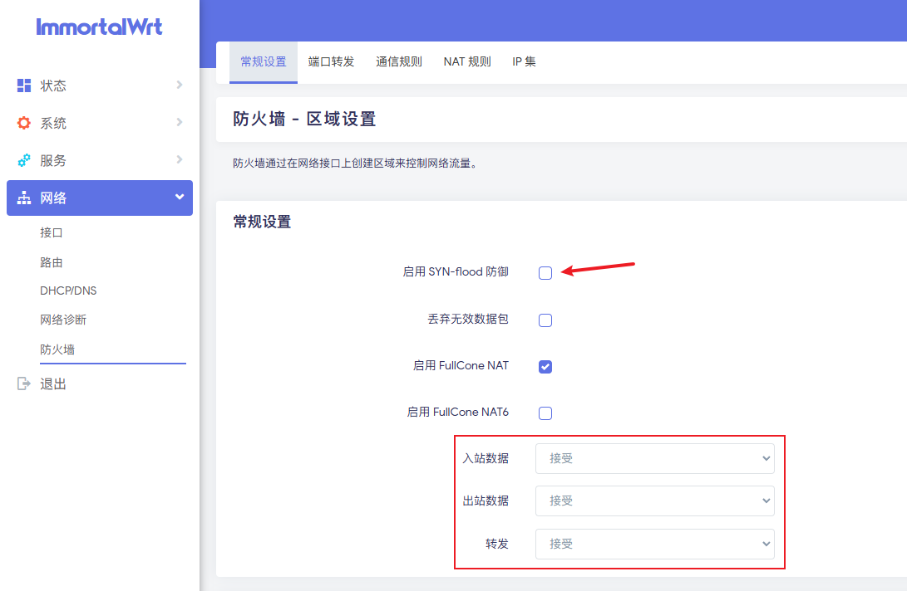

固件下载地址：[https://downloads.immortalwrt.org/](https://downloads.immortalwrt.org/)

主题名称：`luci-theme-Argon`

其他额外的一些东西：`ttyd`、`screen`、`openssh-sftp-server`、`luci-app-homeproxy`、`procd-ujail`（MihomoTProxy额外插件）

**如果纯内核使用mihomo，一定要注意，安装openclash套件需要从ssh里面安装，web控制台会报错**

```
opkg update
opkg install screen
opkg install vim
opkg remove dropbear # 移除自带的ssh
opkg install openssh-server
opkg install openssh-client # 客户端，可不装
opkg install luci-app-openclash
opkg install openssh-sftp-server
opkg install kmod-tun # 安装 TUN 内核模块
opkg install zip unzip
```

## openssh配置

```
# 修改配置文件
vim /etc/ssh/sshd_config

# 将以下内容进行修改
PermitRootLogin yes # 开启 root 用户直接登录
PasswordAuthentication yes # 开启密码登录
GatewayPorts yes # 开启端口访问

#重启服务
/etc/init.d/sshd enable
/etc/init.d/sshd start
/etc/init.d/sshd restart
```

常用命令：`netstat -tulnp`、`tar -czvf proxy.tar.gz ./mihomo`

防火墙推荐设置：



## 扩容

```
apt install parted # 前置环境

gunzip immortalwrt-24.10.0-rc3-x86-64-generic-squashfs-combined-efi.img.gz

dd if=/dev/zero bs=1M count=500 >>openwrt.img

parted openwrt.img

print

resizepart 2 100%

print

quit
```

> 分区读取报错看这个：https://blog.aoe.top/notes/474
> 
> 分区代码：https://www.cnblogs.com/maguyusi/p/18574745
> 
> 博客：https://www.aladown.com/2023/01/OpenWRT-%E6%89%A9%E5%AE%B9%E6%96%B9%E6%B3%95/
