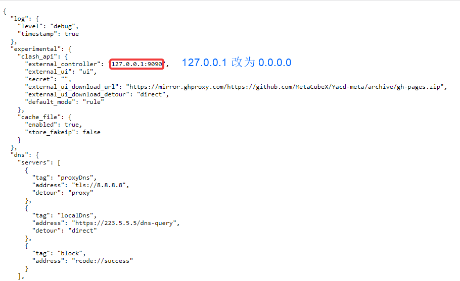
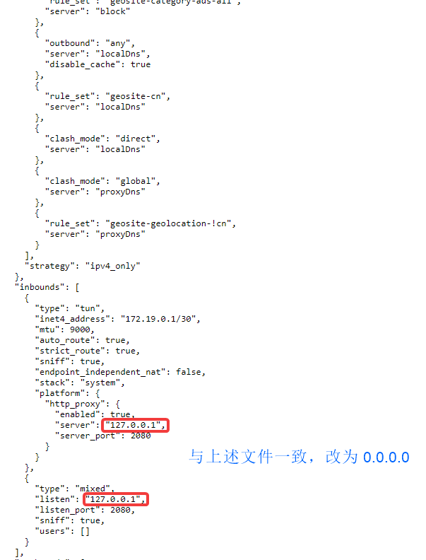

## 订阅转换

官方API

```
https://sing-box-subscribe.vercel.app/config/订阅
```

晓风foke：

```
http://singbox.byxiao.top/config/订阅
```

指定配置文件URL：

```
http://singbox.byxiao.top/config/订阅/&file=https://github.com/Toperlock/sing-box-subscribe/raw/main/config_template/config_template_groups_tun.json
```

# Singbox启动！

下载主程序：[https://github.com/SagerNet/sing-box/releases](https://github.com/SagerNet/sing-box/releases)

`chmod a+x ./singbox`

修改配置文件





启动命令：

```
nohup ./sing-box run -c server.json &
```

结束命令：

```
ps -ef | grep sing-box
kill -9 PID
```

加入系统服务

创建 `singbox.service`

```
[Unit]
Description=singbox
After=network.target
  
[Service]
User=root
Restart=on-failure
RestartSec=1800s
LimitNOFILE=infinity
ExecStart=/home/sing-box run -c /home/singbox/config.json
ExecStop= /bin/bash -c "lsof -i :2080 -t | xargs kill"

[Install]
WantedBy=multi-user.target
```

加入系统服务

`systemctl enable singbox.service `

启动 singbox

`systemctl start singbox.service`

停止 singbox

`systemctl stop singbox.service`

完全卸载系统服务

```
systemctl stop singbox.service

systemctl disable singbox.service

sudo rm /etc/systemd/system/singbox.service

systemctl daemon-reload
```

# 面板

在线：[https://yacd.metacubex.one/](https://yacd.metacubex.one/)

离线：[https://github.com/haishanh/yacd/releases](https://github.com/haishanh/yacd/releases)
